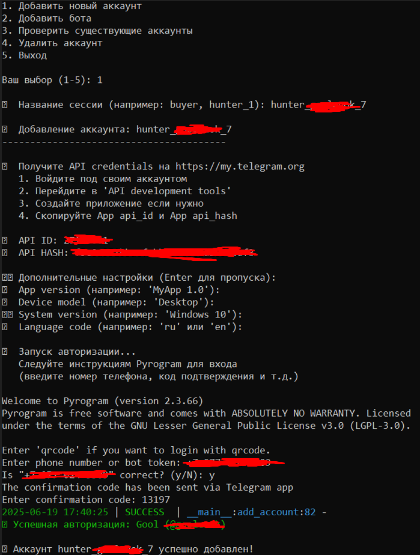
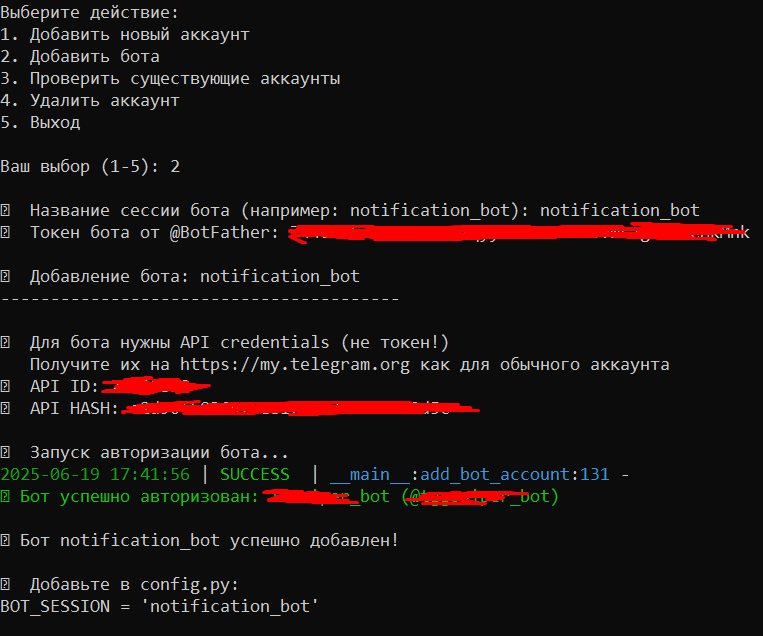

# [*] TGift-Sniper

<div align="center">

**Бот для авто-покупки новых лимитированных подарков Telegram**

[📱 Мой Telegram канал](https://t.me/enbanends_home)

</div>

---

## [i] Описание

**TGift-Sniper** - автоматизированный бот для быстрой покупки новых лимитированных подарков в Telegram. Использует систему аккаунтов-охотников для мониторинга и основной аккаунт для покупки.

---

## >> Инструкция по установке

### [1] Подготовка окружения

Создайте виртуальное окружение и установите зависимости:

```bash
python -m venv venv
venv\scripts\activate
pip install -r requirements.txt
```

### [2] Добавление Telegram аккаунтов

Добавьте телеграм аккаунты (api_hash, api_key, phone_number):

```bash
python auth.py
```
<div align="center">

</div>

### [3] Настройка бота для уведомлений

Добавьте телеграм бота для уведомлений:

> При вводе используйте api_hash и api_key любого аккаунта, но лучше основного

<div align="center">

</div>

### [4] Конфигурация

Настройте следующие параметры в `config.py`:
- Названия сессий для аккаунтов-охотников и аккаунта-покупателя  
- Критерии для покупки (цена, supply и т.д)
- Задержки между запросами

> **Подробное описание всех настроек находится в комментариях в файле config.py**

Также можете настраивать дополнительные параметры в `src\core\constants.py`

---

## [~] Принцип работы

Аккаунты, которых вы назначаете "охотниками" будут проверять новые лимитированные подарки и покупать его если совпадет с вашими критериями (цена, supply и т.д).

Чем больше аккаунтов-охотников, тем чаще будут идти проверки и тем быстрее софт обнаружит новый подарок и купит его. Можно использовать как 1 аккаунт-охотник, так и 10. Я лично использую 4 и мне этого достаточно.

---

## [!] Рекомендации

### Безопасность аккаунтов
- **Основной аккаунт:** Используйте свой основной аккаунт для аккаунта-покупателя, где у вас лежат звезды. Чтобы не потерять средства в случае бана аккаунта.
- **Аккаунты-охотники:** Желательно используйте аккаунты-охотники, которые вы сможете восстановить (например у вас есть физ.симки), т.к я не добавлял поддержку прокси.

### Настройки задержек
- Не ставьте слишком короткие задержки, так аккаунты легко получат фриз (с базовыми настройками банов пока что не прилетало)

### Дополнительно
- Не забудьте написать вашему телеграму боту /start, чтобы он мог отправлять вам сообщения.
- Используйте /ping в телеграм боте чтобы проверить состояние работы софта.

---

## [@] Контакты

**Мой телеграм канал:** https://t.me/enbanends_home